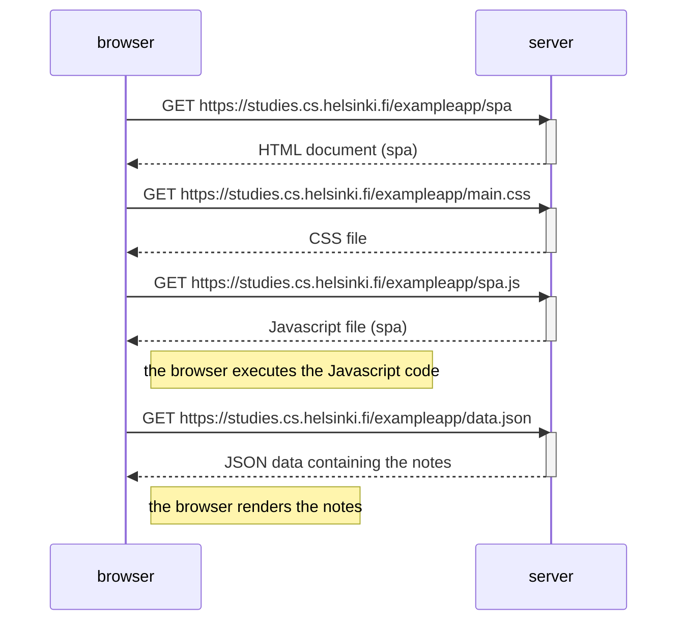

```mermaid
sequenceDiagram
    participant browser
    participant server

    browser->>server: GET https://studies.cs.helsinki.fi/exampleapp/spa
    activate server

    server-->>browser: HTML document (spa)
    deactivate server

    browser->>server: GET https://studies.cs.helsinki.fi/exampleapp/main.css
    activate server

    server-->>browser: CSS file
    deactivate server

    browser->>server: GET https://studies.cs.helsinki.fi/exampleapp/spa.js
    activate server

    server-->>browser: Javascript file (spa)
    deactivate server
    Note right of browser: the browser executes the Javascript code


    browser->>server: GET https://studies.cs.helsinki.fi/exampleapp/data.json
    activate server

    server-->>browser: JSON data containing the notes
    deactivate server
    Note right of browser: the browser renders the notes

```