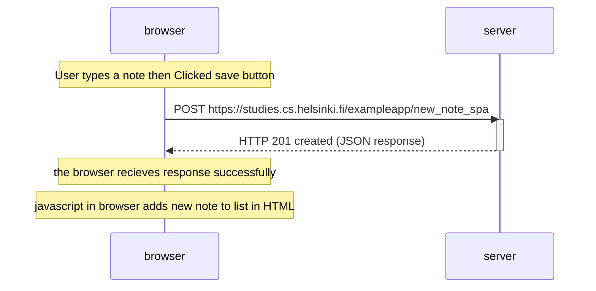

```mermaid
sequenceDiagram
    participant browser
    participant server

    Note over browser: User types a note then Clicked save button
    browser->>server: POST https://studies.cs.helsinki.fi/exampleapp/new_note_spa
    activate server

    server-->>browser: HTTP 201 created (JSON response)
    deactivate server

    Note over browser: the browser recieves response successfully
    Note over browser: javascript in browser adds new note to list in HTML
```